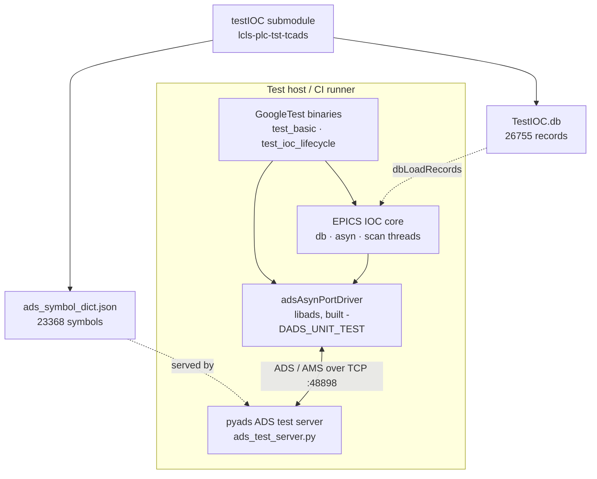
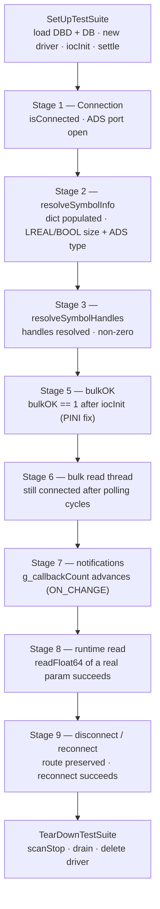
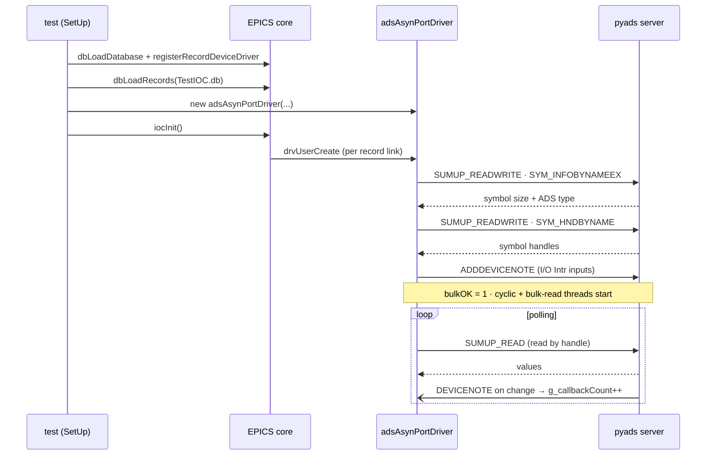
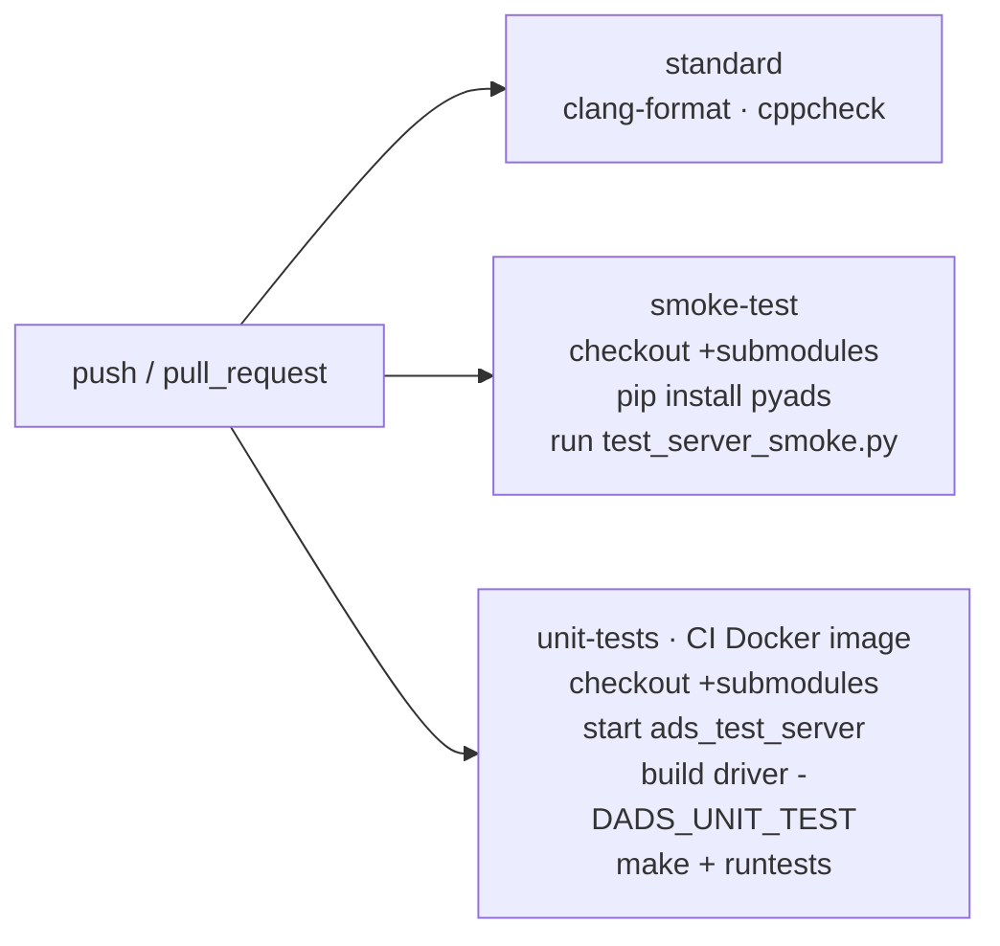

# twincat-ads tests

What the test suite exercises, and how the pieces fit together.

## Layout

| Path | What it is |
|------|------------|
| `tests/unit/test_basic.cpp` | Smallest check: the driver constructs and connects. |
| `tests/unit/test_ioc_lifecycle.cpp` | Full IOC boot lifecycle, 13 GoogleTest stages against a live server. |
| `tests/server/ads_test_server.py` | pyads-based ADS test server; serves the real PLC symbol dict. |
| `tests/server/test_server_smoke.py` | Standalone smoke test of the server (read / write / live updates). |
| `tests/unit/build.md` | How to build and run the unit tests (native `make` and CI Docker image). |

The driver is built with `-DADS_UNIT_TEST`, which compiles in test-only hooks
(`setGlobalInstance`, `g_callbackCount`). Symbols and records come from the
`testIOC` submodule (`pcdshub/lcls-plc-tst-tcads`): a 26755-record `TestIOC.db`
and a 23368-symbol `ads_symbol_dict.json`.

## How the pieces connect

The unit test process *is* a minimal IOC: it loads the DB, creates the driver,
and calls `iocInit()`. The driver talks ADS to the Python server exactly as it
would to a real TwinCAT PLC.

## Lifecycle stages

`test_ioc_lifecycle.cpp` shares one driver instance across all stages
(`SetUpTestSuite` / `TearDownTestSuite`). The stage numbers follow the driver's
boot sequence, so the list skips 4.

| Stage | Test(s) | Asserts |
|-------|---------|---------|
| 1 | `Stage1_ConnectedToServer`, `Stage1_AdsPortOpen` | Driver connected; local ADS port > 0. |
| 2 | `Stage2_SymbolDictPopulated`, `Stage2_LrealSymbolResolved`, `Stage2_BoolSymbolResolved` | Symbol dict filled; LREAL is 8 bytes / `ADST_REAL64`, BOOL is 1 byte / `ADST_BIT`. |
| 3 | `Stage3_HandlesAcquired`, `Stage3_AllTestSymbolsHaveHandles` | BOOL/DINT/LREAL each resolved to a non-zero handle. |
| 5 | `Stage5_BulkOKSet` | `bulkOK == 1` once the IOC is running. |
| 6 | `Stage6_DriverRemainsConnectedAfterPolling` | Still connected after bulk-read cycles. |
| 7 | `Stage7_CallbacksFired` | At least one notification callback fires (counter advances). |
| 8 | `Stage8_DirectReadSucceeds` | Direct `readFloat64` of a registered param returns `asynSuccess`. |
| 9 | `Stage9_DisconnectPreservesRoute`, `Stage9_ReconnectSucceeds` | ADS route survives disconnect; reconnect succeeds. |

`test_basic.cpp` is independent: it constructs a driver, asserts it connects,
and deletes it.

## Boot sequence and ADS exchange

What `iocInit()` triggers, and the ADS traffic between driver and server.

Teardown is ordered to avoid a use-after-free: `scanStop()` halts the EPICS scan
threads and a short sleep drains in-flight processing **before** `delete driver`,
so no record callback dereferences a `paramInfo` while the destructor is freeing
it. The driver also rejects `adsReadParam`/`adsWriteParam` once `stopThreads_` is
set, as a second guard.

## CI

`.github/workflows/standard.yml` runs three jobs on push / PR.

Both `smoke-test` and `unit-tests` check the `testIOC` submodule out, because the
symbol dict and DB live there. See [`unit/build.md`](unit/build.md) to run the
suite locally.
